# SWIRL Card Manager

SWIRL Card Manager is the app for Windows and macOS that puts SWIRL on a GDEMU SD card and looks after it. It
is a single exe on Windows and a single app on the Mac, with the same features on both. Press **F1** in the app for a summary of everything below, the keyboard shortcuts and the credits.

Changes you make (names, art, collections, music, order) are saved on the card in a `SWIRL` folder straight
away. They reach the Dreamcast when you click **Update SWIRL**, which rebuilds the menu in folder `01`.
Game folders are never changed by an update.

## SD card

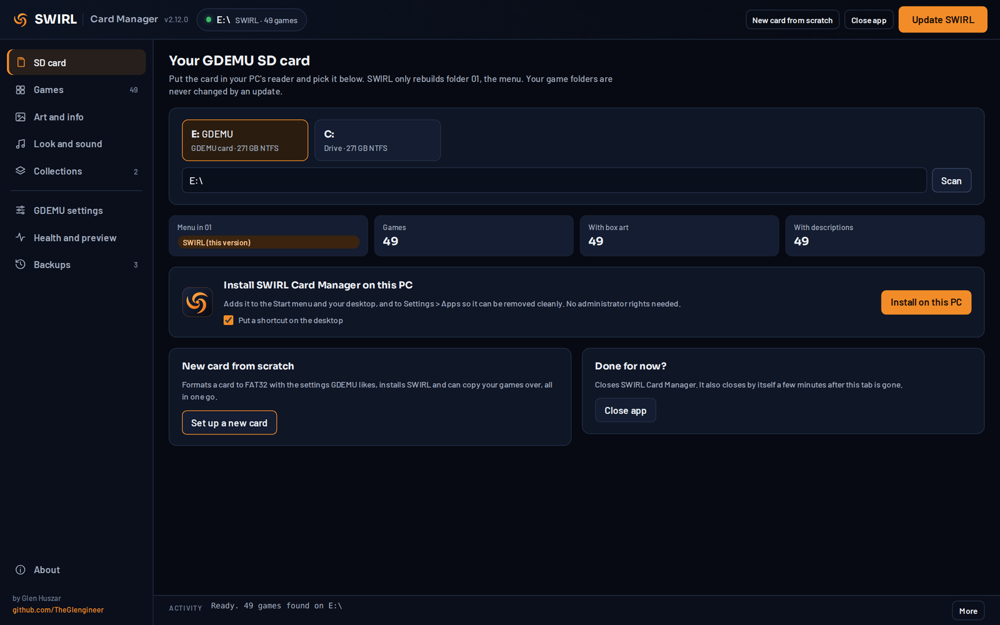

Pick the card from the list of drives, or type a drive letter and click **Scan**. The page shows which menu
is in folder `01`, how many games the card has and how many have box art and descriptions. From here you
can also install the app on your PC, start a new card, or close the app.

## Games

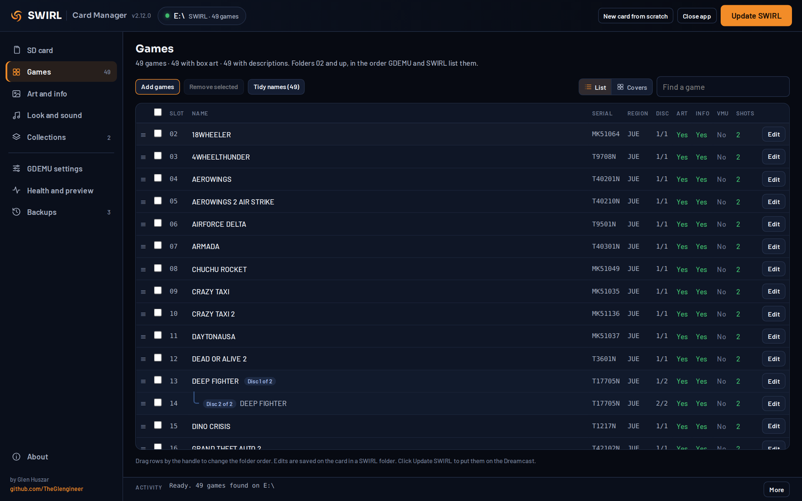

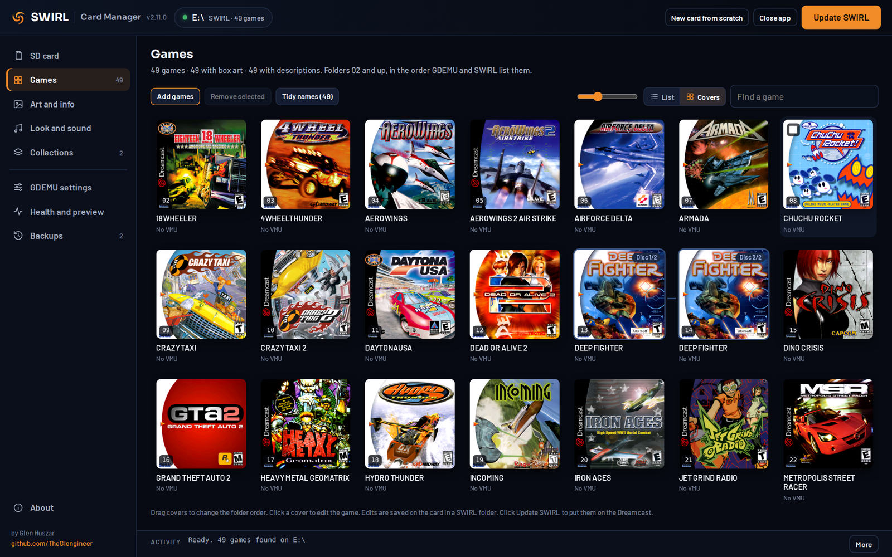

- **List** or **Covers** view, with a slider for cover size. The choice is remembered.
- **Add games**: a file browser for folders, disc images and archives (see below).
- **Remove selected**: tick games, then remove them. They are moved to `SWIRL_BACKUP` on the card, the remaining folders are renumbered with no gaps, and the menu is rebuilt.
- **Drag to reorder**: drag rows by the handle, or drag covers, then **Save new order**. GDEMU and SWIRL list games in folder order.
- **Tidy names**: proper titles from the Redump list, matched by each disc's serial. For discs the list does not know, it offers the name without version or dump tags ("Toy Commander v1.022" becomes "Toy Commander"). You see every change before it is made, and names you typed yourself are never changed.
- **Put discs together**: keeps the discs of multi disc games next to each other and in order. Discs of one game are grouped in the list.
- **Find a game** (Ctrl+F) filters the list.

### Adding games

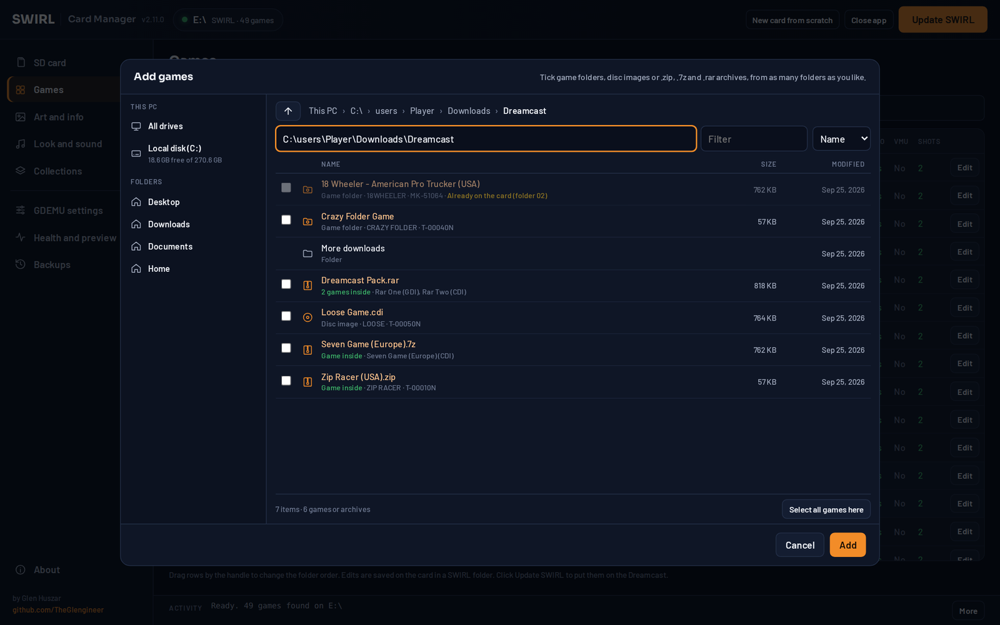

The browser lists every drive (with free space), your Desktop, Downloads and Documents and recent folders.
It shows game folders, `.gdi`, `.cdi`, `.mds` and `.ccd` images and `.zip`, `.7z` and `.rar` archives
(including multi part RAR). It looks inside archives, tells you what each one holds and marks games that
are already on the card (same serial and disc number). Tick games from as many folders as you like, then
click **Add**. Archives are unpacked straight into the new game folder on the card, with no temporary copy
on your PC.

### Editing a game

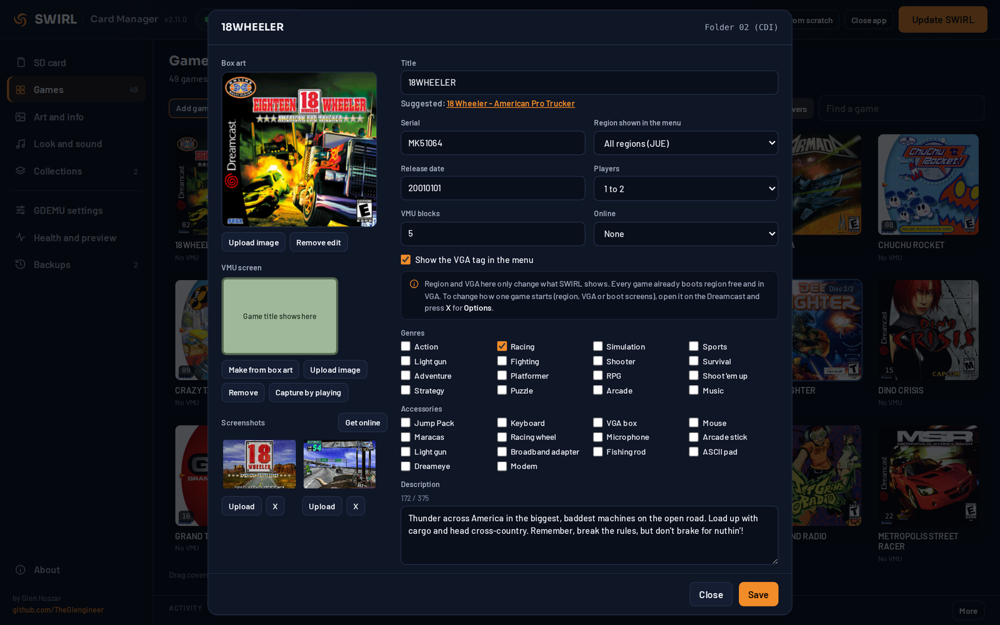

Click a game (or **Edit**) to change:

- **Title**, with a suggested proper name you can accept in one click
- **Box art**: upload a picture, or go back to the disc's own art
- **VMU screen**: make one from the box art, upload one, or capture it by playing the game in the emulator
- **Screenshots**: upload two, or **Get online** from libretro thumbnails
- **Serial, region and VGA tag shown in the menu, release date, players, VMU blocks, online support, genres, accessories and description**

Region and VGA here only change what SWIRL shows. How a game starts is set on the Dreamcast, in the game's
launch options (see [Using SWIRL](USING_SWIRL.md#launch-options)).

## Art and info

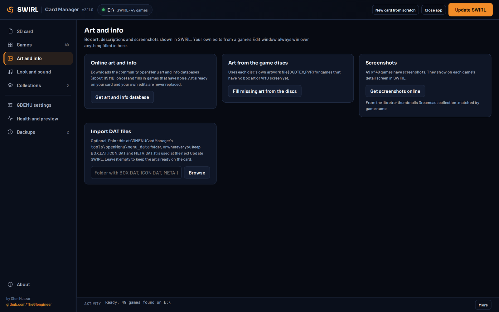

- **Online art and info**: downloads the openMenu box art and game info databases and fills in what your games are missing.
- **Art from the game discs**: uses the artwork inside each disc for games with no box art.
- **Screenshots**: fetches two screenshots per game from libretro thumbnails.
- **Import DAT files**: brings in `BOX.DAT`, `ICON.DAT` and `META.DAT` from a GDMENUCardManager or openMenu setup.

Your own edits from a game's Edit window always win over downloaded art.

## Look and sound

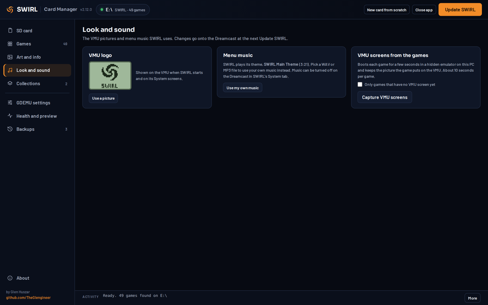

- **VMU logo**: shown on the VMU when SWIRL starts. Use your own picture, or go back to the SWIRL logo.
- **Menu music**: SWIRL plays its theme unless you pick your own WAV or MP3. The theme cannot be deleted, only replaced by your own music, and **Back to the SWIRL theme** restores it.
- **VMU screens from the games**: boots each game for a few seconds in a hidden emulator and keeps the picture it draws on the VMU. About 10 seconds per game.

## Collections

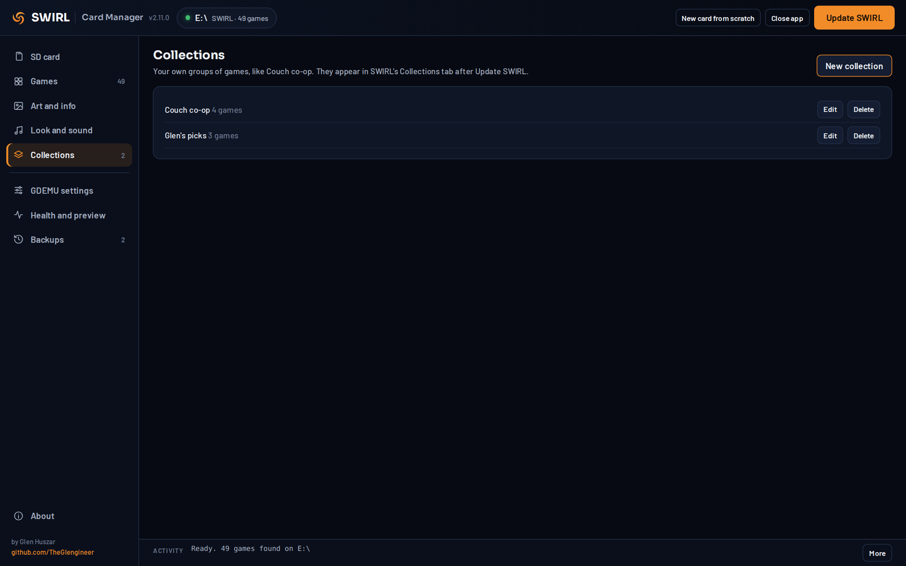

Make your own groups of games, such as "Couch co-op". They appear in SWIRL's Collections tab, next to the
ones SWIRL builds for you.

## GDEMU settings

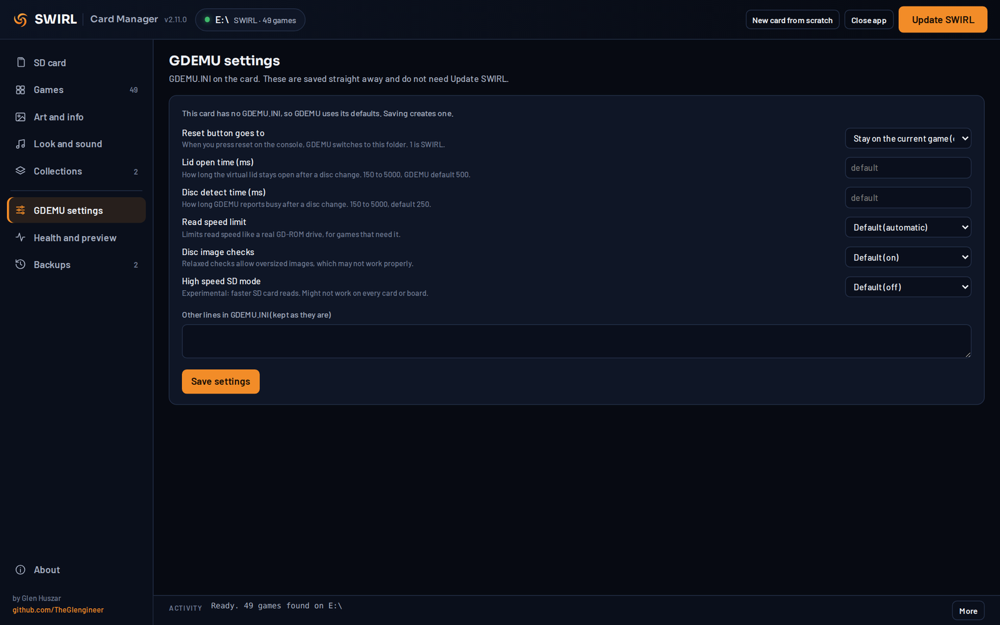

Edits `GDEMU.INI` on the card: what reset does, open time, disc detect time, read speed limit, image
checks and high speed SD mode. Each setting is explained on the page. Comments and unknown lines in the
file are kept.

## Health and preview

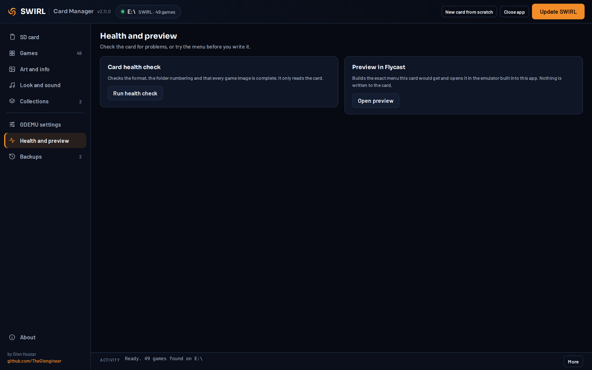

- **Card health check**: checks the format (GDEMU needs FAT32), free space, that folder `01` holds a menu, that folder numbers have no gaps (GDEMU stops at the first gap), that every disc image is complete, and finds leftover system files.
- **Preview in Flycast**: boots the exact menu your card would get, in an emulator on your PC.

## Backups

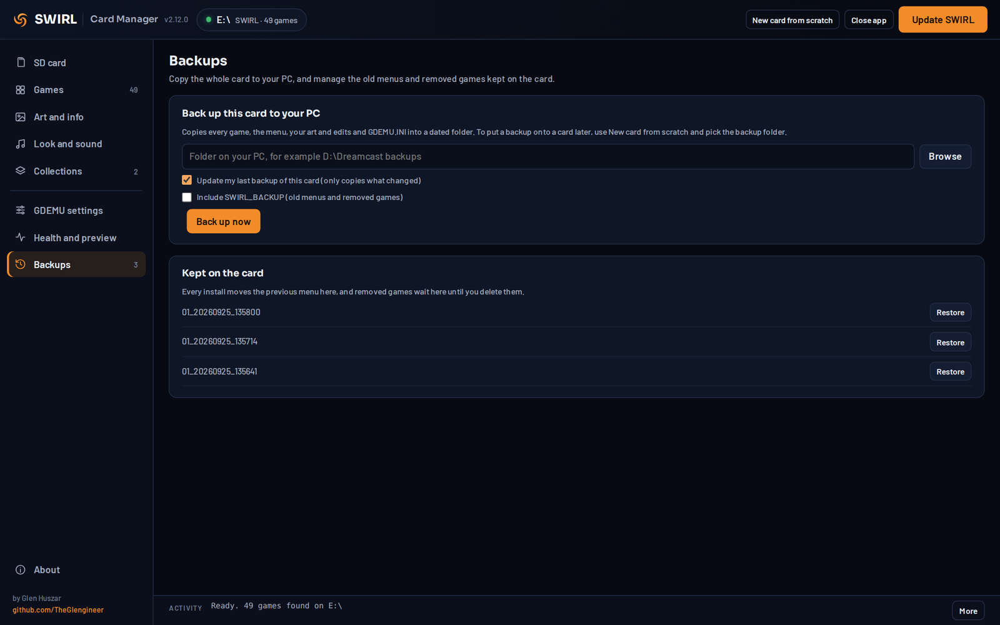

**Back up this card to your PC** copies every game, the menu, your art and edits and `GDEMU.INI` into a dated
folder on your PC.

- **Update my last backup** (on by default) only copies what changed and removes what you deleted from the card, so repeat backups are quick. Each card gets a hidden ID, so updates never mix two cards.
- **Include SWIRL_BACKUP** adds the old menus and removed games kept on the card.
- **Cancel** stops part way; running it again with Update ticked finishes it.
- To put a backup onto a card, use **New card from scratch** and pick the backup folder.

**Kept on the card** lists previous menus (restore any of them into folder `01`) and removed games (delete them for good to free the space).

## New card from scratch

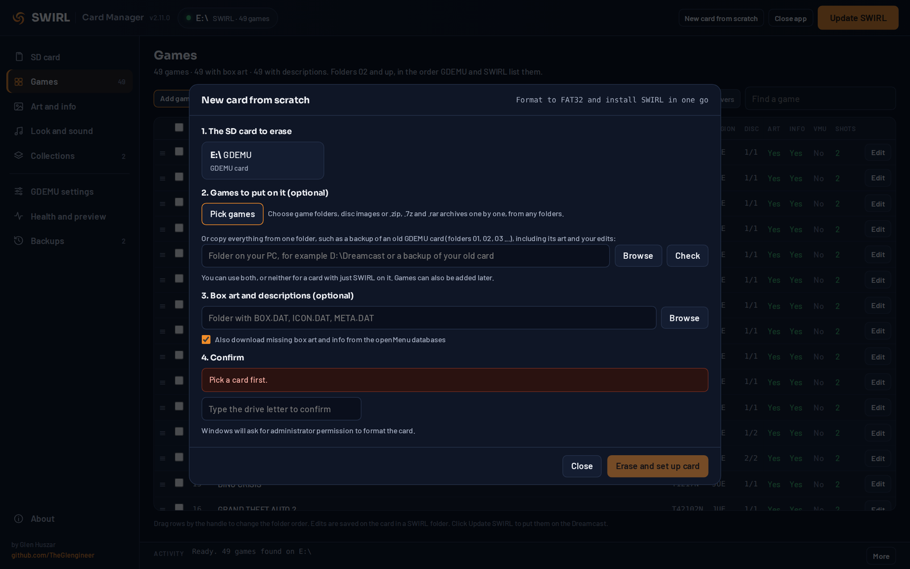

Formats a card to FAT32 with the settings GDEMU likes, installs SWIRL and copies your games in one go. Pick
games one by one, copy everything from one folder (such as a backup of an old card), or neither for a card
with just SWIRL. Windows asks for administrator permission, and macOS for your password, to format. On a Mac you confirm by typing the card's name instead of its drive letter.

## About and updates

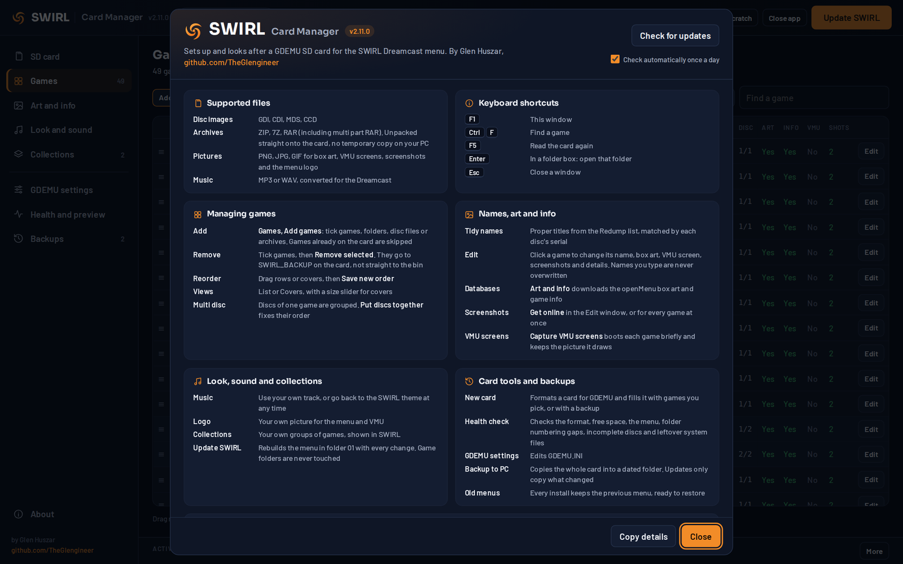

**About** (F1) lists the supported files, keyboard shortcuts, what each page does, the credits, and details of
this copy that you can copy into a bug report.

Card Manager checks GitHub for a newer version once a day (you can turn this off in About). When there is
one, a bar appears at the top with **What's new** and **Update now**. Updating downloads the new exe,
verifies its SHA-256 checksum, installs it and reopens the app. Then click **Update SWIRL** to put the new
menu on your card.

## Keyboard shortcuts

| Keys | What they do |
|---|---|
| F1 | About |
| Ctrl + F | Find a game |
| F5 | Read the card again |
| Enter | In a folder box: open that folder |
| Esc | Close a window |

## Command line

The exe also has a few command line options, mostly for testing:

```
"SWIRL Card Manager.exe" -root E:\ -scan       list what is on the card
"SWIRL Card Manager.exe" -root E:\ -install    install or update SWIRL in folder 01
"SWIRL Card Manager.exe" -root E:\ -restore 01_20260925_101500
"SWIRL Card Manager.exe" -uninstall            remove the app from this PC
```

Run it with `-h` for the full list.
