# SWIRL Card Manager

SWIRL Card Manager is the app for Windows (and macOS, in beta) that puts SWIRL on a GDEMU SD card and looks after it. It
is a single exe on Windows and a single app on the Mac, with the same features on both. Press **F1** in the app for a summary of everything below, the keyboard shortcuts and the credits.

Changes you make (names, art, collections, music, order) are saved on the card in a `SWIRL` folder straight
away. They reach the Dreamcast when you click **Update SWIRL**, which rebuilds the menu in folder `01`.
Game folders are never changed by an update.

## SD card

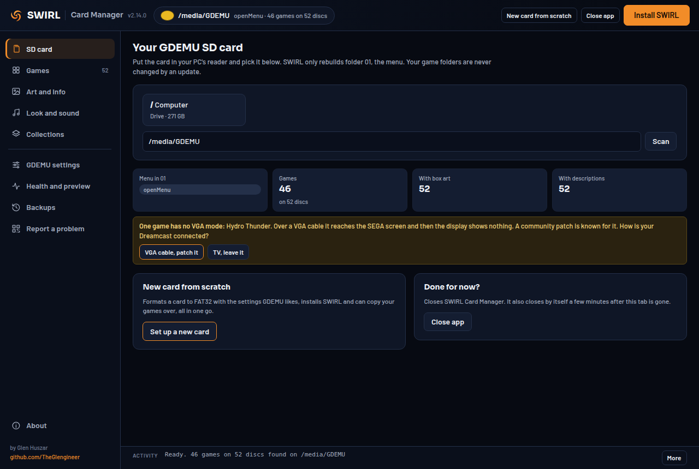

Pick the card from the list of drives, or type a drive letter and click **Scan**. The page shows which menu
is in folder `01`, how many games the card has (a multi disc game is one game, so it says both numbers, for
example **46 games on 52 discs**) and how many have box art and descriptions. From here you can also install the
app on your PC, start a new card, or close the app.

Whatever is in folder `01` is recognised: a GDI or CDI menu (openMenu, GDMENU, the Virtual Folder Bundle), a game,
or an unknown image. A game in `01` blocks the install with a message instead of being moved. Game folders are
numbered up to 9999, as on cards from GDMENUCardManager and the Virtual Folder Bundle.

### Games with no VGA mode

The first time the card holds a game that has no VGA mode of its own and a community patch is known for it, the
page asks **How is your Dreamcast connected?**

- **VGA cable, patch it**: the game is patched at once, and any game you add later that needs one is patched when
  it is found.
- **TV, leave it**: nothing is patched. You can still patch one game from its Edit page.

The answer is kept under [About](#about-and-updates), where you can change it.

## Games

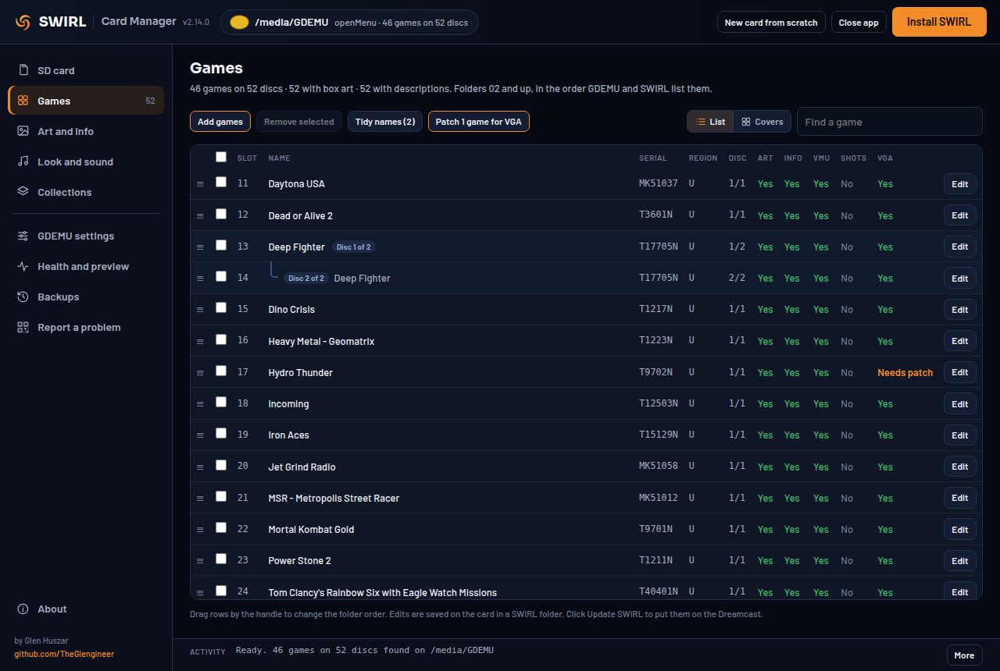

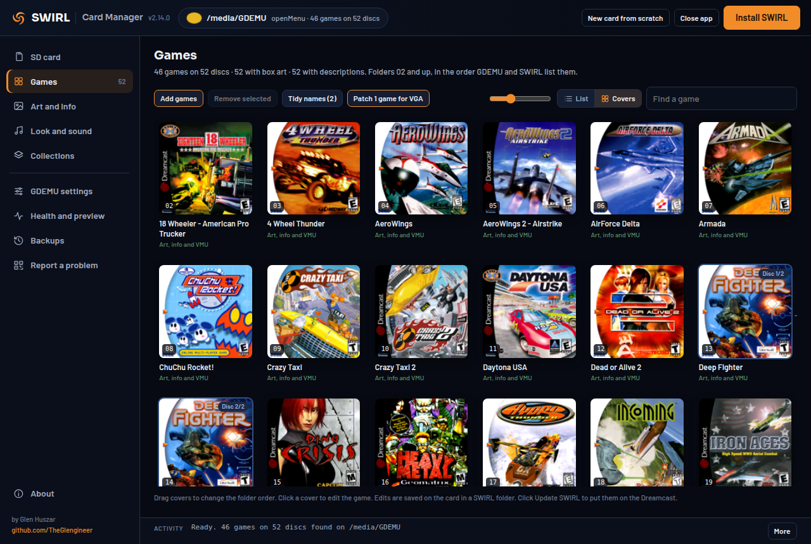

- **List** or **Covers** view, with a slider for cover size. The choice is remembered.
- **Add games**: a file browser for folders, disc images and archives (see below).
- **Remove selected**: tick games, then remove them. They are moved to `SWIRL_BACKUP` on the card, the remaining folders are renumbered with no gaps, and the menu is rebuilt.
- **Drag to reorder**: drag rows by the handle, or drag covers, then **Save new order**. GDEMU and SWIRL list games in folder order.
- **Tidy names**: proper titles from the Redump list, matched by each disc's serial. For discs the list does not know, it offers the name without version or dump tags ("Toy Commander v1.022" becomes "Toy Commander"). You see every change before it is made, and names you typed yourself are never changed.
- **Put discs together**: keeps the discs of multi disc games next to each other and in order. Discs of one game are grouped in the list.
- **Find a game** (Ctrl+F) filters the list.
- The **VGA** column says **Needs patch** for a game with no VGA mode that has a known patch, **Patched** once the
  patch is on the card, and **No (patch removed)** for one you took off by hand (it is not patched again by
  itself). **Patch N games for VGA** above the list patches every game that needs it.

### Adding games

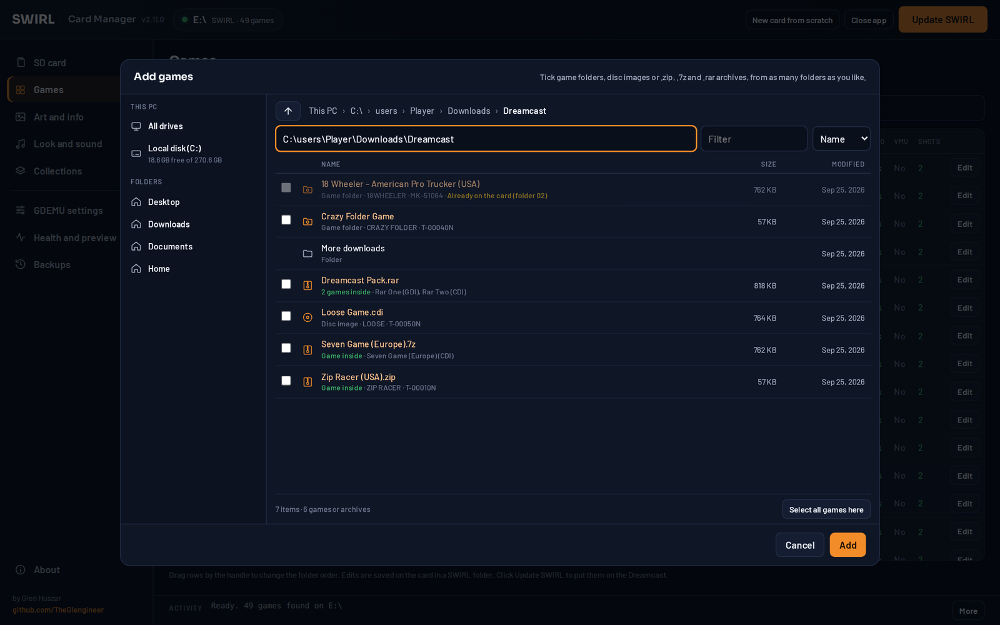

The browser lists every drive (with free space), your Desktop, Downloads and Documents and recent folders.
It shows game folders, `.gdi`, `.cdi`, `.mds` and `.ccd` images and `.zip`, `.7z` and `.rar` archives
(including multi part RAR). It looks inside archives, tells you what each one holds and marks games that
are already on the card (same serial and disc number). Tick games from as many folders as you like, then
click **Add**. Archives are unpacked straight into the new game folder on the card, with no temporary copy
on your PC.

### Editing a game

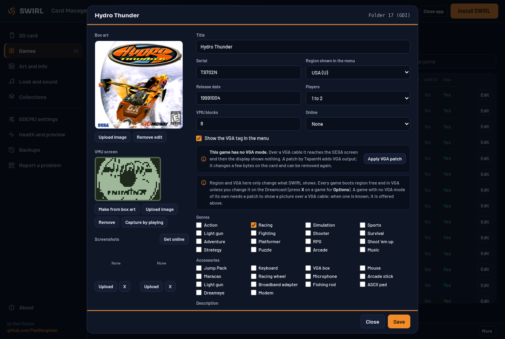

Click a game (or **Edit**) to change:

- **Title**, with a suggested proper name you can accept in one click
- **Box art**: upload a picture, or go back to the disc's own art
- **VMU screen**: make one from the box art, upload one, or capture it by playing the game in the emulator
- **Screenshots**: upload two, or **Get online** from libretro thumbnails
- **Serial, region and VGA tag shown in the menu, release date, players, VMU blocks, online support, genres, accessories and description**
- **Apply VGA patch** or **Remove VGA patch**, with the patch author, for a game with no VGA mode. The patch
  changes a few bytes of the game in place on the card; the original bytes are kept under
  `SWIRL_BACKUP\patches` and **Remove** puts them back. Only GDI images can be patched in place; a CDI says so.

Region and VGA here only change what SWIRL shows. How a game starts is set on the Dreamcast, in the game's
launch options (see [Using SWIRL](USING_SWIRL.md#launch-options)).

The patches ship inside Card Manager: the first is Hydro Thunder v1.020 (USA) by TapamN. To add your own, put a
`catalog.json` in the same shape as the built in one, next to the `.dcp` files it names, in the `patches` folder
under Card Manager's data folder (**About > Copy details** shows the path).

## Art and info

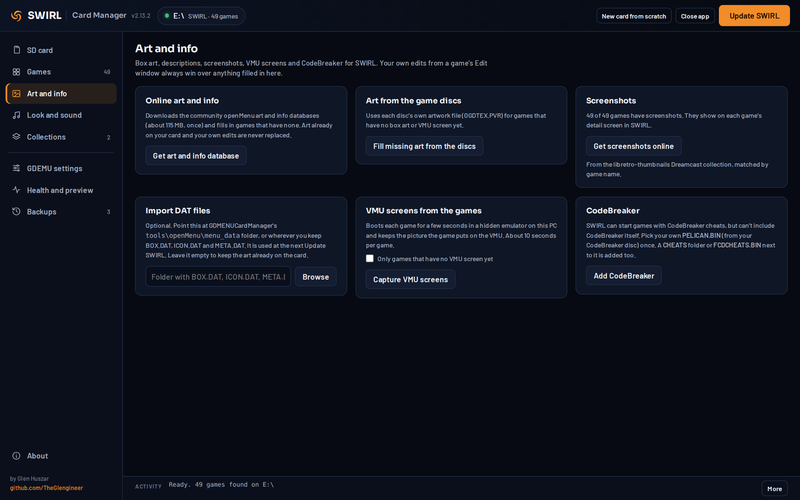

- **Online art and info**: downloads the openMenu box art and game info databases and fills in what your games are missing.
- **Art from the game discs**: uses the artwork inside each disc for games with no box art.
- **Screenshots**: fetches two screenshots per game from libretro thumbnails.
- **Import DAT files**: brings in `BOX.DAT`, `ICON.DAT` and `META.DAT` from a GDMENUCardManager or openMenu setup.
- **VMU screens from the games**: boots each game for a few seconds in a hidden emulator and keeps the picture it draws on the VMU. About 10 seconds per game.
- **CodeBreaker**: pick your own CodeBreaker `PELICAN.BIN` once (a `CHEATS` folder or `FCDCHEATS.BIN` next to it is added too). **Update SWIRL** puts it on the menu disc, and SWIRL's launch options then offer **Play with CodeBreaker cheats**. SWIRL can't include CodeBreaker itself.

Your own edits from a game's Edit window always win over downloaded art.

## Look and sound

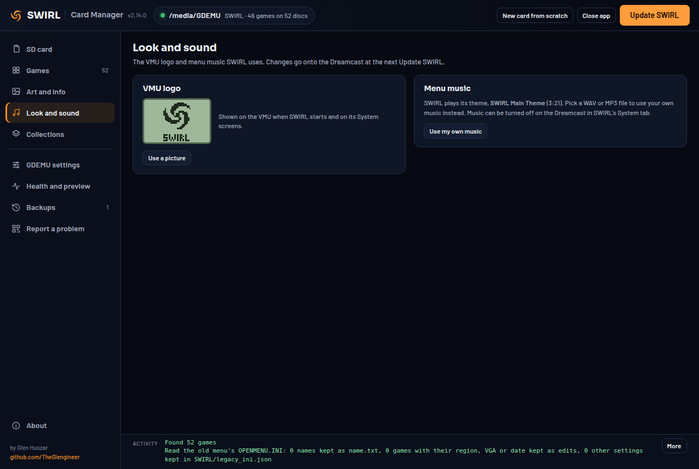

- **VMU logo**: shown on the VMU when SWIRL starts. Use your own picture, or go back to the SWIRL logo.
- **Menu music**: SWIRL plays its theme unless you pick your own WAV or MP3. The theme cannot be deleted, only replaced by your own music, and **Back to the SWIRL theme** restores it.

## Collections

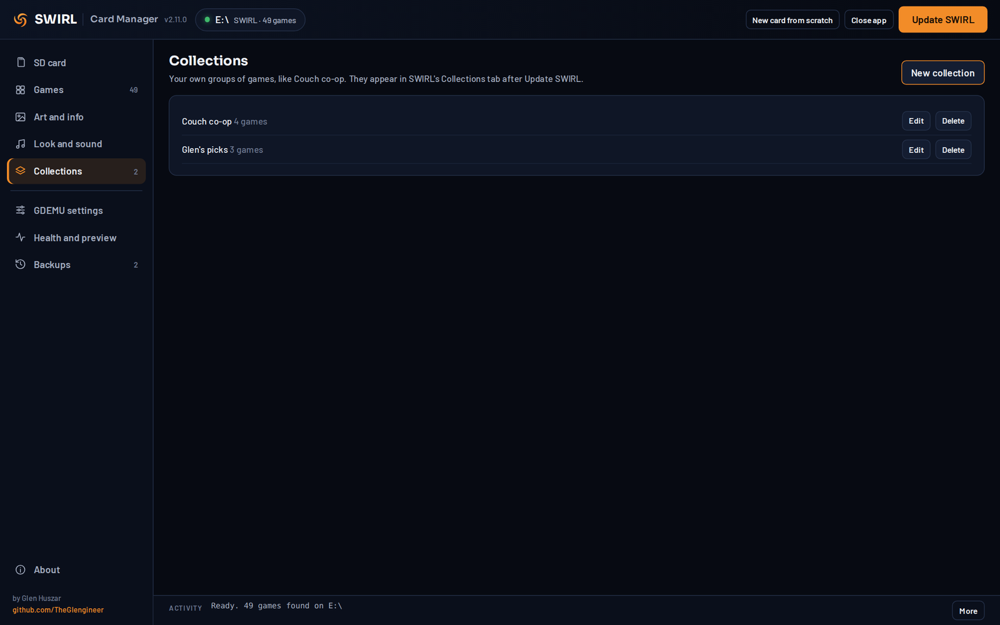

Make your own groups of games, such as "Couch co-op". They appear in SWIRL's Collections tab, next to the
ones SWIRL builds for you.

## GDEMU settings

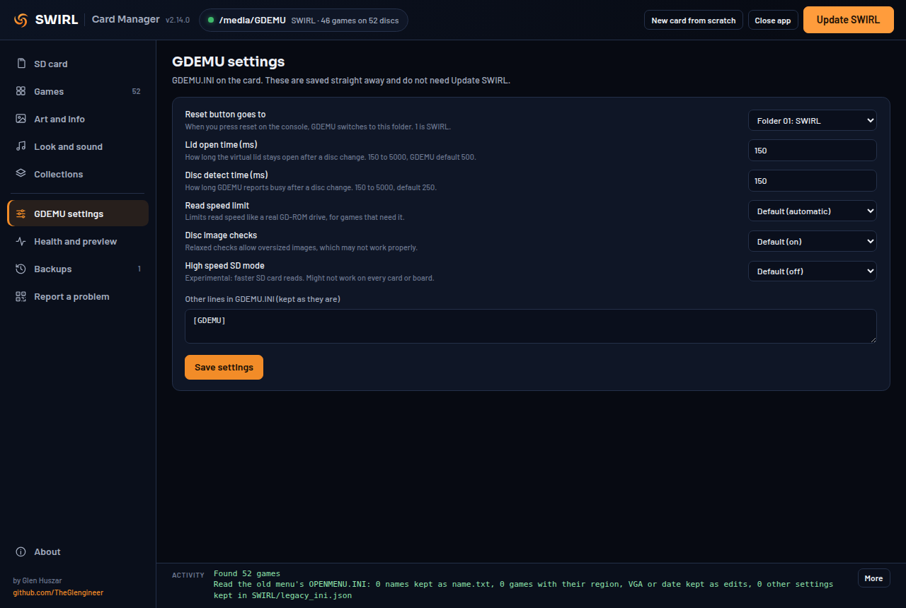

Edits `GDEMU.INI` on the card: what reset does, open time, disc detect time, read speed limit, image
checks and high speed SD mode. Each setting is explained on the page. Comments and unknown lines in the
file are kept.

## Health and preview

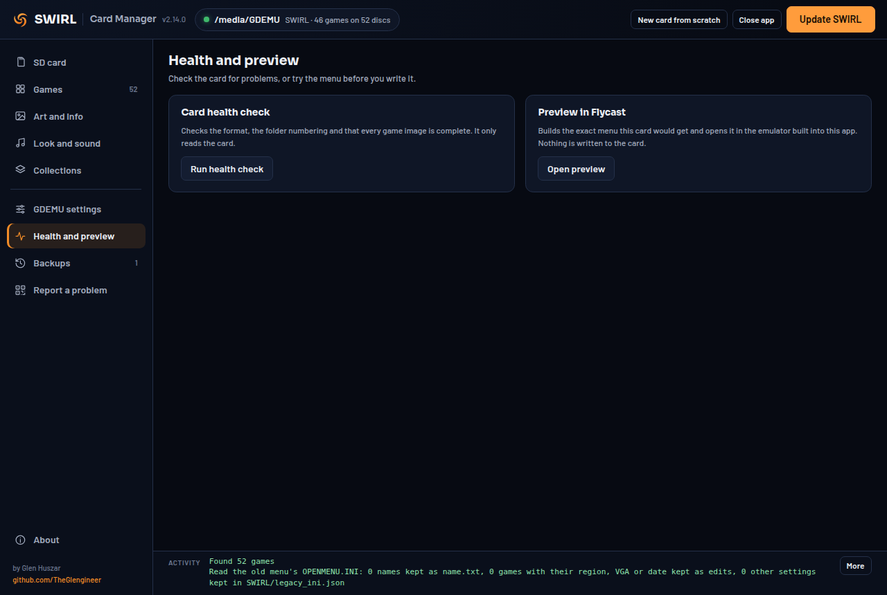

- **Card health check**: checks the format (GDEMU needs FAT32), free space, that folder `01` holds a menu, that folder numbers have no gaps (GDEMU stops at the first gap), that every disc image is complete, that the art and info files are readable and of a known version, that `DISCDB.JSON` matches the folders, and finds leftover system files. **Close the gaps** renumbers the folders and rebuilds the menu; it is journaled, so a failure part way undoes itself.
- **Preview in Flycast**: boots the exact menu your card would get, in an emulator on your PC. The preview bar has a **Report a problem** button.

## Backups

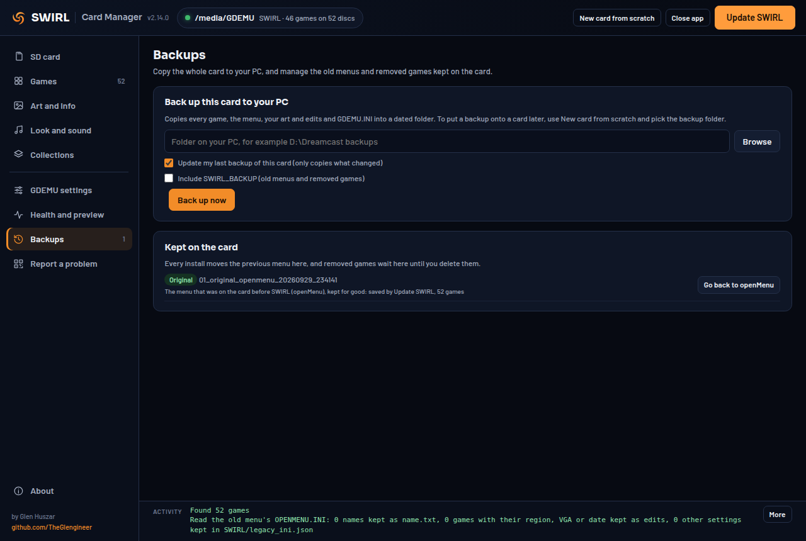

**Back up this card to your PC** copies every game, the menu, your art and edits and `GDEMU.INI` into a dated
folder on your PC.

- **Update my last backup** (on by default) only copies what changed and removes what you deleted from the card, so repeat backups are quick. Each card gets a hidden ID, so updates never mix two cards.
- **Include SWIRL_BACKUP** adds the old menus and removed games kept on the card.
- **Cancel** stops part way; running it again with Update ticked finishes it.
- To put a backup onto a card, use **New card from scratch** and pick the backup folder.

**Kept on the card** lists previous menus (restore any of them into folder `01`) and removed games (delete them for good to free the space).

- The menu that was on the card before SWIRL (openMenu, GDMENU or the Virtual Folder Bundle) is kept as
  `01_original_...`, listed first with an **Original** badge, and never pruned. Its button says **Go back to
  openMenu** (or whichever menu it was). The newest few menus SWIRL built are kept; older ones are pruned.
- Every menu backup has a manifest next to it (which menu, when, why, which game was in which slot). A backup
  with a missing or short file cannot be restored and says so. One whose games no longer match the card asks
  first, lists the differences, and **Restore anyway** goes ahead; install SWIRL again afterwards to fix the list.

## New card from scratch

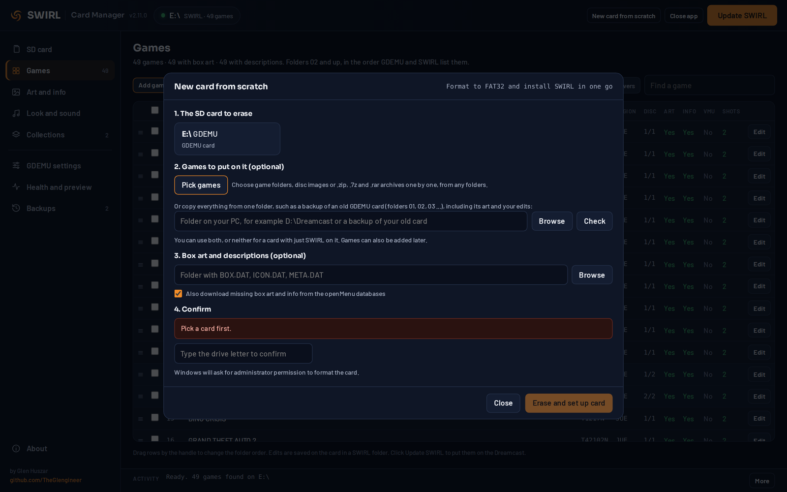

Formats a card to FAT32 with the settings GDEMU likes, installs SWIRL and copies your games in one go. Pick
games one by one, copy everything from one folder (such as a backup of an old card), or neither for a card
with just SWIRL. Windows asks for administrator permission, and macOS for your password, to format. On a Mac you confirm by typing the card's name instead of its drive letter.

## About and updates

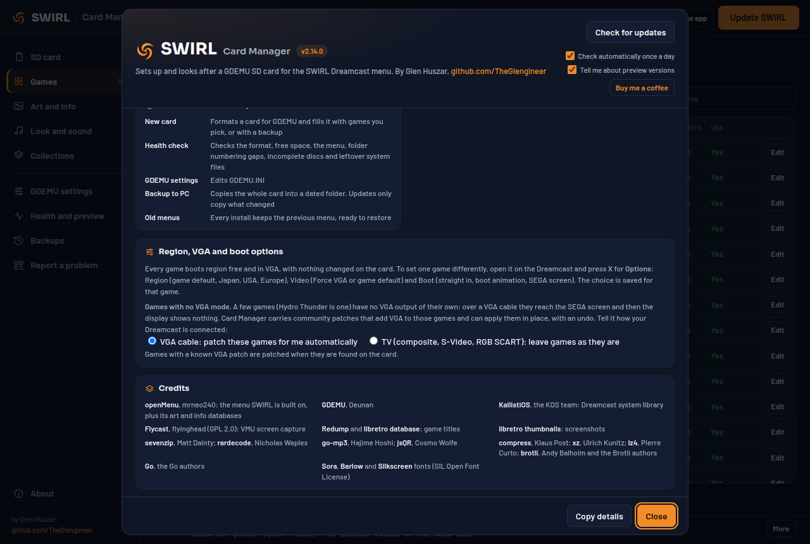

**About** (F1) lists the supported files, keyboard shortcuts, what each page does, the credits, and details of
this copy that you can copy into a bug report. Under **Region, VGA and boot options** it holds the video output
choice from the SD card page: **VGA cable** (games with a known VGA patch are patched when they are found) or
**TV** (nothing is patched). **Diagnostics** there explains the report the Dreamcast can draw as QR codes.

Card Manager checks GitHub for a newer version once a day (you can turn this off in About). When there is
one, a bar appears at the top with **What's new** and **Update now**. Updating downloads the new exe,
verifies its SHA-256 checksum, installs it and reopens the app. Then click **Update SWIRL** to put the new
menu on your card.

Opening the app while a copy is already running shows that copy's window, except when the new copy is a newer
version or a different build of the same version (a test build): then it takes over and the running copy closes,
so the card gets the menu you meant to test.

### Previews

Before a big version is released, a **preview** of it may be put up for testing. Previews are never
installed by **Update now** or the automatic check. When one is up, a green bar says so, with:

- **See what's new**: the preview's notes, including what to test.
- **Try the preview**: installs the preview copy of Card Manager (checksum verified, like any update). Then
  click **Update SWIRL** to put the preview menu on your card.
- **Not now**: hides the bar until the next preview.

While you use a preview, a bar reminds you and links to **Report a problem**. To go back, open **About** and
click **Back to the released version**, then **Update SWIRL**. Your games, art and settings are not changed
by either step. To stop hearing about previews, untick **Tell me about preview versions** in About.

## Report a problem

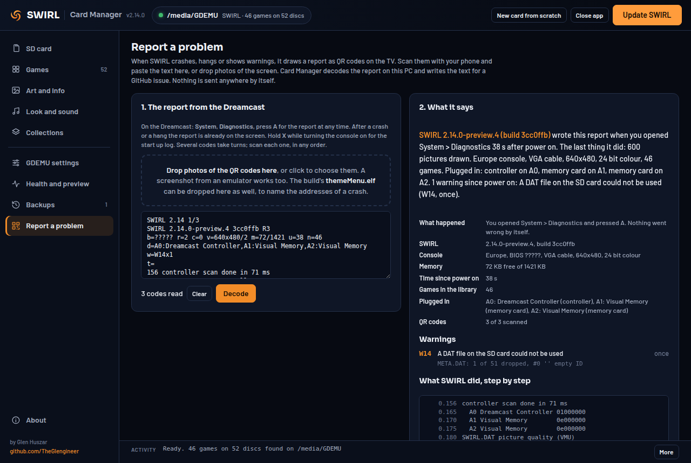

When SWIRL crashes, hangs or shows warnings, it draws a report as QR codes on the TV (**System > Diagnostics**,
then **A**; after a crash the codes are on the screen already; hold **X** at power on for the start up log).
Scan them with your phone and paste the text here, in any order, or drop photos of the screen on the page. A
screenshot from an emulator works too. **Decode** shows the report in plain words: what happened, the console and
what was plugged in, each warning and what it means, where a crash stopped, and the steps SWIRL took.

**Copy for GitHub** puts a ready to paste issue on the clipboard: the report in plain words, the raw text, this
Card Manager's version and, when a card is open, what is on it. Say what you were doing at the top and paste it
into a new issue. Nothing is sent anywhere by itself.

For a crash, the addresses are named after functions when the build's symbols file is at hand: drop
`themeMenu.elf` or `SWIRL-<version>-symbols.elf` on the page, or put it in the `symbols` folder under Card
Manager's data folder. The format of the report is in [DIAGNOSTICS.md](DIAGNOSTICS.md).

## Coming from openMenu, GDMENU or the Virtual Folder Bundle

Taking over a card keeps what the old menu knew. Names, regions, VGA flags and dates in its `OPENMENU.INI` that
differ from the disc become SWIRL edits; keys SWIRL does not use are kept in `SWIRL/legacy_ini.json` and written
back. `BLEEM.BIN` comes along from a GDMENU disc. From the Virtual Folder Bundle, its virtual folders become
SWIRL collections once (`SWIRL/vfb-folders-imported.txt` marks that; delete it to do it again), `type.txt` and
`disc.txt` are carried, and `DISCDB.JSON` is kept in step with the folders when games are added, removed or
renumbered. A database that cannot be read is set aside in `SWIRL_BACKUP` with a note.

## Keyboard shortcuts

| Keys | What they do |
|---|---|
| F1 | About |
| Ctrl + F | Find a game |
| F5 | Read the card again |
| Enter | In a folder box: open that folder |
| Esc | Close a window |

## Command line

The exe also has a few command line options, mostly for testing:

```
"SWIRL Card Manager.exe" -root E:\ -scan       list what is on the card
"SWIRL Card Manager.exe" -root E:\ -install    install or update SWIRL in folder 01
"SWIRL Card Manager.exe" -root E:\ -restore 01_20260925_101500
"SWIRL Card Manager.exe" -uninstall            remove the app from this PC
```

Run it with `-h` for the full list.
