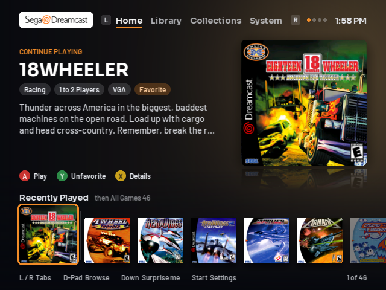
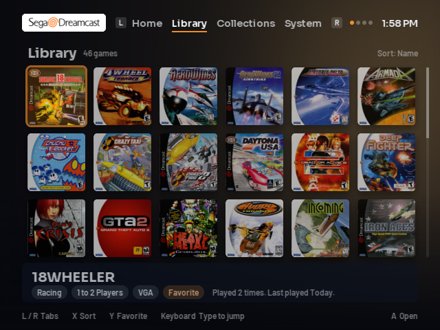
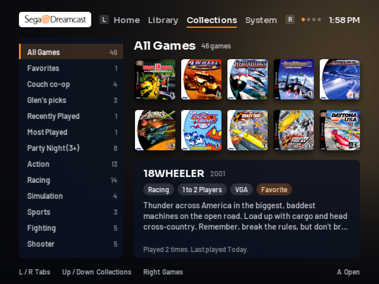
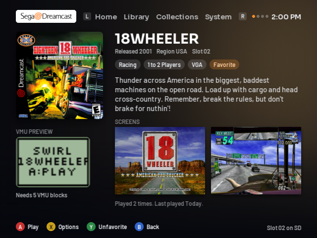
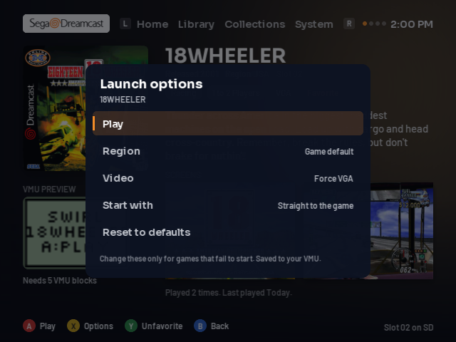
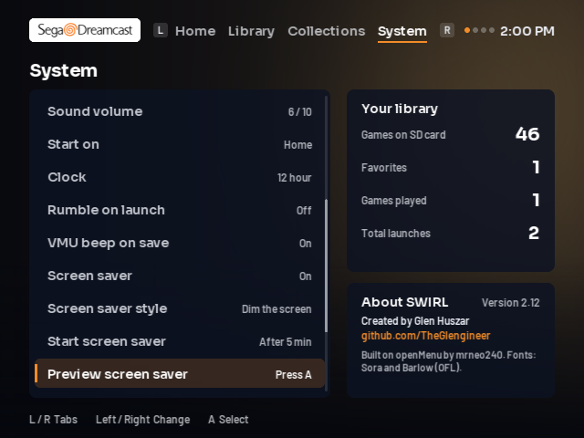
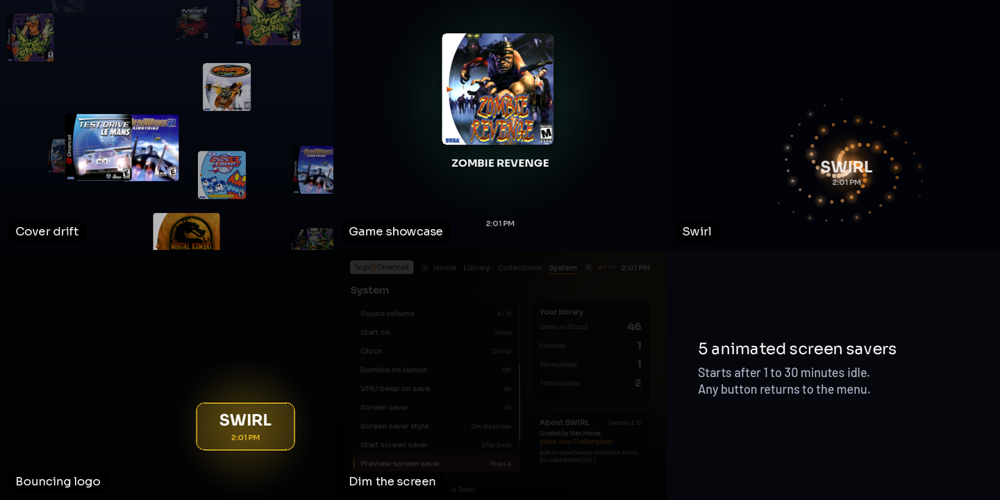

# Using SWIRL

SWIRL starts when the Dreamcast boots from the GDEMU. It fades in once the first box art and the music
are ready, and the VMU shows the SWIRL logo.

## Controls

| Button | What it does |
|---|---|
| L / R | Switch between Home, Library, Collections and System |
| D-Pad | Browse |
| A | Play (Home) or open (Library, Collections) |
| X | Game page (Home), change sort (Library), launch options (game page) |
| Y | Add or remove a favorite |
| B | Back |
| Start | Jump to System |
| Down on Home | Surprise me: spins to a random game |
| Keyboard (Library) | Type a name to jump to it |
| A + B + X + Y + Start while playing | Reset back to SWIRL |

The Sega Dreamcast logo sits at the top left of every screen. It comes from openMenu's theme on the
menu disc, which Card Manager adds when a card does not have it.

## Home

The game you played last, with its box art, genres, players, description and buttons. The row below starts
with your recently played games, then the rest of the library from A to Z. Press **A** to play, **Y** to
favorite, **X** for the game page. Press **Down** for Surprise me.

## Library

Every game as a 6 by 3 grid of covers. **X** changes the sort: name, recently played, most played or
release year. With a Dreamcast keyboard plugged in, type to jump to a game. **A** opens the game page.

## Collections

Collections are built from your library and your play history:

- **All Games**, **Favorites**, **Recently Played**, **Most Played**
- **Party Night (3+)**, **Online**, **Light Gun**
- One collection per genre (Action, Racing, Fighting and so on)
- **VGA Compatible**, **Imports**, **Homebrew & Other**
- Your own collections, made in SWIRL Card Manager

Collections with no games are hidden. **Up / Down** picks a collection, **Right** moves into its games.

## Game page

Release year, region and folder, tags, the full description, up to two screenshots, what the game shows on
the VMU and how many VMU blocks it needs, and how often and when you last played it. Multi disc games show
a disc picker.

### Launch options

Press **X** on the game page. Every game already starts region free and in VGA, so you only need this for a
game that misbehaves or that you want to start differently:

| Option | Choices |
|---|---|
| Region | Game default, Japan, USA, Europe |
| Video | Force VGA, Game default |
| Start with | Straight to the game, Boot animation, SEGA screen, Animation and SEGA |
| Reset to defaults | Clears the options for this game |

Choices are saved per game on your VMU, and the game page then shows **Options (custom)**.

If the menu disc has `PELICAN.BIN` (a CodeBreaker image), the sheet also offers **Play with CodeBreaker
cheats**. PlayStation discs are started through Bleem when `BLEEM.BIN` is on the menu disc.

## System

Left and right change a setting; **A** runs an action.

| Setting | Choices |
|---|---|
| Menu style | SWIRL, Classic list, Classic grid, GDMENU |
| Accent colour | Orange, Blue, Green, Pink, Purple, Red, Gold, Teal |
| Backdrop | Cover colour, Night, Seasonal |
| Picture quality | High, Standard |
| Menu music, Music volume | On or off, 0 to 10 |
| Navigation sounds, Sound volume | On or off, 0 to 10 |
| Start on | Home, Last played game |
| Clock | 12 hour, 24 hour (uses the Dreamcast's own clock) |
| Rumble on launch | On, Off |
| VMU beep on save | On, Off |
| Screen saver | On, Off (on by default) |
| Screen saver style | Cover drift, Game showcase, Swirl, Bouncing logo, Dim the screen |
| Start screen saver | After 1 to 30 minutes (5 by default) |
| Preview screen saver | Shows the chosen style now |
| VMU saves | Lists the saves on each memory card and can delete them |
| Save settings to VMU | Saves now (SWIRL also saves on its own) |
| Controller test | Shows every button and stick |
| Exit to Dreamcast BIOS | Leaves SWIRL |

The panel on the right shows how many games, favorites and launches you have, and **About SWIRL** with the version.

## Screen savers

After the chosen number of minutes without a button press, SWIRL starts the screen saver. Any button brings
the menu back, and that press does nothing else.

## What is saved, and where

Favorites, play history, launch options and SWIRL settings are saved as `SWIRL.DAT` on the first VMU with
space. Nothing is written to the SD card by the Dreamcast.
