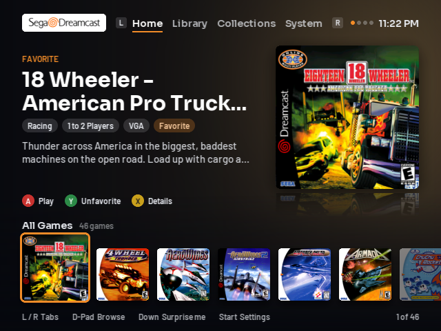
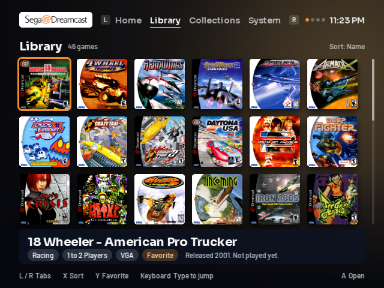
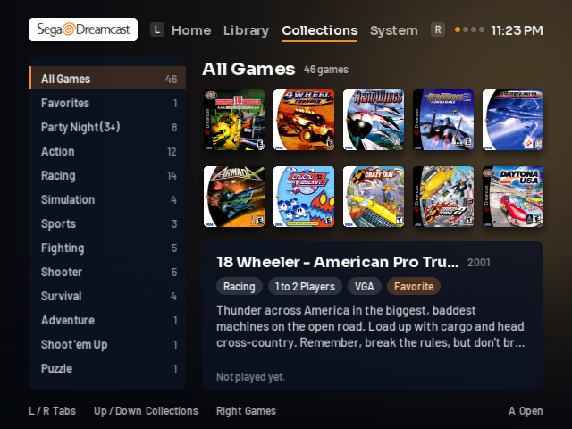
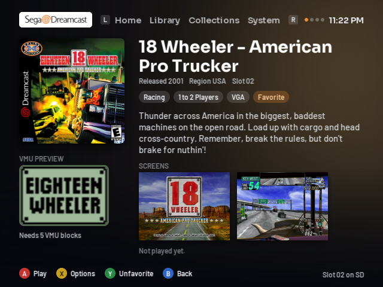
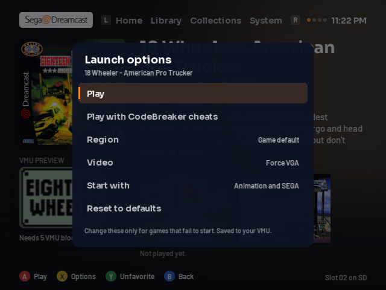
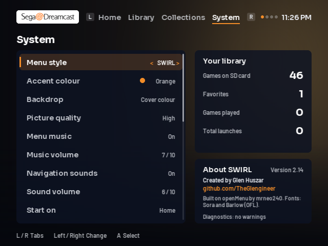
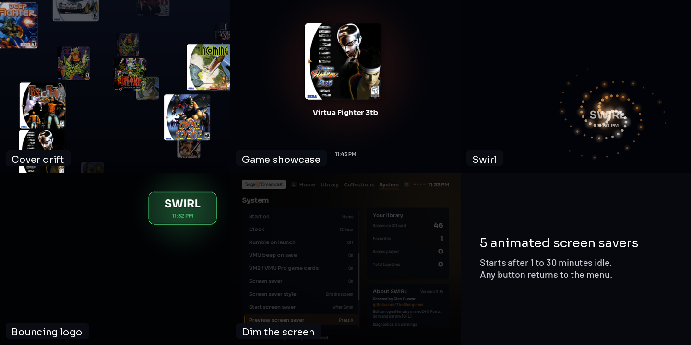

# Using SWIRL

SWIRL starts when the Dreamcast boots from the GDEMU. It fades in once the first box art and the music
are ready, and the VMU shows the SWIRL logo.

## Controls

| Button | What it does |
|---|---|
| L / R | Switch between Home, Library, Collections and System |
| D-Pad | Browse |
| A | Play (Home) or open (Library, Collections) |
| X | Game page (Home), change sort (Library), launch options (game page) |
| Y | Add or remove a favorite |
| B | Back |
| Start | Jump to System |
| Down on Home | Surprise me: spins to a random game |
| Keyboard (Library) | Type a name to jump to it |
| A + B + X + Y + Start while playing | Reset back to SWIRL (from games that route the reset through the BIOS, see [Getting back to SWIRL](#getting-back-to-swirl-from-a-game)) |

The Sega Dreamcast logo sits at the top left of every screen. It comes from openMenu's theme on the
menu disc, which Card Manager adds when a card does not have it.

## Home

The game you played last, with its box art, genres, players, description and buttons. The row below starts
with your recently played games, then the rest of the library from A to Z. Press **A** to play, **Y** to
favorite, **X** for the game page. Press **Down** for Surprise me.

## Library

Every game as a 6 by 3 grid of covers. **X** changes the sort: name, recently played, most played or
release year. With a Dreamcast keyboard plugged in, type to jump to a game. **A** opens the game page.

## Collections

Collections are built from your library and your play history:

- **All Games**, **Favorites**, **Recently Played**, **Most Played**
- **Party Night (3+)**, **Online**, **Light Gun**
- One collection per genre (Action, Racing, Fighting and so on)
- **VGA Compatible**, **Imports**, **Homebrew & Other**
- Your own collections, made in SWIRL Card Manager

Collections with no games are hidden. **Up / Down** picks a collection, **Right** moves into its games.

## Game page

Release year, region and folder, tags, the full description, up to two screenshots, what the game shows on
the VMU and how many VMU blocks it needs, and how often and when you last played it. Multi disc games show
a disc picker.

### Launch options

Press **X** on the game page. Every game already starts region free and in VGA, so you only need this for a
game that misbehaves or that you want to start differently:

| Option | Choices |
|---|---|
| Region | Game default, Japan, USA, Europe |
| Video | Force VGA, Game default |
| Start with | Animation and SEGA (the default), Straight to the game, Boot animation, SEGA screen |
| Reset to defaults | Clears the options for this game |

Choices are saved per game on your VMU, and the game page then shows **Options (custom)**.

Games start with the boot animation and the SEGA screen, as they do from openMenu and GDMENU. That is how every
game was tested by its makers, and some rely on what the BIOS sets up during the SEGA screen. **Start with:
Straight to the game** skips both for one game.

### Games with no VGA mode

A few games (Hydro Thunder is one) have no VGA output of their own. Over a VGA cable they reach the SEGA screen
and then the display says **no signal**: the game is running, in a mode the display cannot show. SWIRL Card
Manager carries community VGA patches for such games and applies them in place on the card, a few bytes with an
undo. The first time a card holds one, the SD card page asks how your Dreamcast is connected. Without the patch,
set **Video: Game default** on that game and play it over a TV. See [Card Manager](CARD_MANAGER.md#games-with-no-vga-mode).

### When a launch comes back

SWIRL never waits for ever on the GDEMU. If the drive does not answer the image change within three seconds, or
the game's disc does not become ready within ten, SWIRL switches back to the menu disc and says why:
**GDEMU did not answer the image change** or **The disc did not become ready**. A launch that would write over
the loader's memory stops with **Out of memory: switch the console off and on**. If the menu disc does not come
back either, SWIRL stops on a report screen (see [Diagnostics](#diagnostics)). A launch that came back is
counted as a warning under **System > Diagnostics**.

**Play with CodeBreaker cheats** starts the game through CodeBreaker. SWIRL can't include CodeBreaker, so
add your own `PELICAN.BIN` once in SWIRL Card Manager (**Art and info > CodeBreaker**) and run **Update
SWIRL**; until then the option is greyed out. PlayStation discs are started through Bleem when `BLEEM.BIN` is on the menu disc.

## System

Left and right change a setting; **A** runs an action.

Changes save to the VMU by themselves. A banner at the bottom shows where that is: "Unsaved changes. Saving in
3", then "Saving... please wait", then "Saved to VMU" (or why it couldn't save). Wait for "Saved to VMU" before
switching off. **Menu style** is the exception: pick a style with left and right, then press **A** to switch.
It saves straight away.

| Setting | Choices |
|---|---|
| Menu style | SWIRL, Classic list, Classic grid, GDMENU. Press **A** to switch (it saves at once); a style picked but not switched to is dropped when you leave the row. The Classic styles use openMenu's theme files, which **Update SWIRL** adds; without them the setting says "needs Update SWIRL". Hold **Y** while the Dreamcast starts, until SWIRL appears, to go back to SWIRL |
| Accent colour | Orange, Blue, Green, Pink, Purple, Red, Gold, Teal |
| Backdrop | Cover colour, Night, Seasonal |
| Picture quality | High, Standard |
| Menu music, Music volume | On or off, 0 to 10 |
| Navigation sounds, Sound volume | On or off, 0 to 10 |
| Start on | Home, Last played game |
| Clock | 12 hour, 24 hour (uses the Dreamcast's own clock) |
| Rumble on launch | On, Off |
| VMU beep on save | On, Off |
| VM2 / VMU Pro game cards | On, Off (on by default). See [VM2 and VMU Pro](#vm2-and-vmu-pro) |
| Screen saver | On, Off (on by default) |
| Screen saver style | Cover drift, Game showcase, Swirl, Bouncing logo, Dim the screen |
| Start screen saver | After 1 to 30 minutes (5 by default) |
| Preview screen saver | Shows the chosen style now |
| VMU saves | Lists the saves on each memory card and can delete them |
| Save settings to VMU | Saves now (SWIRL also saves on its own). Shows where your settings are saved, for example "Saved on VMU A1", or why they aren't yet |
| Controller test | Shows every button and stick |
| Exit to Dreamcast BIOS | Leaves SWIRL |
| Diagnostics | The warnings since power on, in plain words with a code, and **A** for the whole report as QR codes (see [Diagnostics](#diagnostics)) |

The panel on the right shows how many games, favorites and launches you have, and **About SWIRL** with the version
and how many warnings Diagnostics holds.

## Diagnostics

SWIRL keeps a log of what it does from power on and counts anything that goes wrong without stopping it.
**System > Diagnostics** lists those warnings in plain words with a code, the count and the first detail. With
nothing to report it says **No warnings since power on**. The codes are:

| Code | Plain words |
|---|---|
| W01 | A save to the VMU failed |
| W02 | SWIRL.DAT on the VMU was damaged |
| W03 | A picture on the SD card could not be used |
| W04 | OPENMENU.INI has lines SWIRL could not use |
| W05 | The GDEMU did not answer |
| W06 | A game did not start and SWIRL came back |
| W07 | A memory card answered after start up |
| W08 | SWIRL's memory reached the loader's line |
| W09 | OPENMENU.CFG on the VMU was damaged |
| W10 | META.DAT could not be used |
| W11 | A theme file on the SD card could not be used |
| W12 | A game has more discs than SWIRL shows |
| W13 | No room on the VMU for SWIRL's save |
| W14 | A DAT file on the SD card could not be used |
| W15 | Not enough video memory for the pictures |
| W16 | A controller port did not answer at start up |
| W17 | A start up step failed |
| W18 | The saved style needs theme files this disc lacks |
| W19 | The menu disc could not be read |

Press **A** there for the whole report as QR codes: scan each one with your phone, or photograph the screen, and
bring them to **Report a problem** in Card Manager. **A** turns the page, **B** goes back to the menu. After a
crash, or when the menu makes no progress for 12 seconds, the codes are on the screen already and take turns by
themselves. Hold **X** while the Dreamcast turns on for the start up log the same way. The report holds no game
names beyond the last few steps. The format is in [DIAGNOSTICS.md](DIAGNOSTICS.md).

## Screen savers

After the chosen number of minutes without a button press, SWIRL starts the screen saver. Any button brings
the menu back, and that press does nothing else.

## The VMU screen

The VMU shows the picture for the game you're on. At power on and on the System tab it plays an animated SWIRL
logo (or animates your own logo, if you added one with Card Manager). When settings are saved it follows the
banner on the TV: a 3, 2, 1 countdown, "saving", then a tick and SAVED, or a cross with the reason if the save
didn't work.

## Getting back to SWIRL from a game

Hold **A + B + X + Y** and press **Start**. It brings you back to SWIRL only from games that route the reset
through the BIOS: Crazy Taxi, Sonic Adventure and most Sega titles. Games that reset to their own title screen
(18 Wheeler, AeroWings, Hydro Thunder and most arcade ports) never call the BIOS, so nothing SWIRL can do
catches them; switch the console off and on. It needs `reset_goto = 1` in `GDEMU.INI`, which Card Manager sets.

## VM2 and VMU Pro

A VM2, VMU Pro, USB4MAPLE or Pico2Maple can keep a separate memory card for each game. When you start a game,
SWIRL tells it which game it is (the Game ID), so it switches to that game's own card. SWIRL sends it only when a
game starts, after it has saved your settings, and only to these devices; a standard VMU is never sent anything.
A device that is busy or silent cannot hold up a game: SWIRL waits about a second in total, then starts it.
It is on by default. Turn it off in **System > VM2 / VMU Pro game cards** to keep one card for everything. The
Classic styles follow the same setting.

A memory card that answers after start up (a VM2 still switching cards, a slow VMU) is read within eight seconds
instead of ignored until the next power on: the favorites and settings come back, and a saved Classic style
starts. Diagnostics counts it as W07.

## What is saved, and where

Favorites, play history, launch options and SWIRL settings are saved as `SWIRL.DAT` on the first VMU with
space. Each save is written under the other of two names (`SWIRL.DAT`, then `SWIRL.BAK`, then `SWIRL.DAT`
again), read back, and only then is the older copy removed. A VMU pulled or a VM2 switching cards half way
through a save keeps the previous copy; SWIRL starts from the newest copy that reads back intact. Older SWIRL
builds read the file unchanged. A save needs room for the new copy on top of the one already on the card (2 to 8
blocks, more with a long history); a full card says **No space on VMU. Free N blocks in VMU saves**, and
**System > VMU saves** can delete a save to make room. Nothing is written to the SD card by the Dreamcast.

The menu style, theme, beep, sort, filter and multidisc settings are openMenu's and live in `OPENMENU.CFG`,
written in openMenu's own format (version 1) so openMenu and the Virtual Folder Bundle read it unchanged if
you go back to them. The first time SWIRL runs with a card it switches the style to SWIRL once and remembers
that in `SWIRL.DAT`; from then on the style in `OPENMENU.CFG` stands, whichever menu set it.

An entry whose type is `other` (an audio CD, or anything that is not a Dreamcast game, as the Virtual Folder
Bundle marks them) is selected on the GDEMU and then handed to the console's own menu, which plays or starts
it, instead of going through the game loader.
